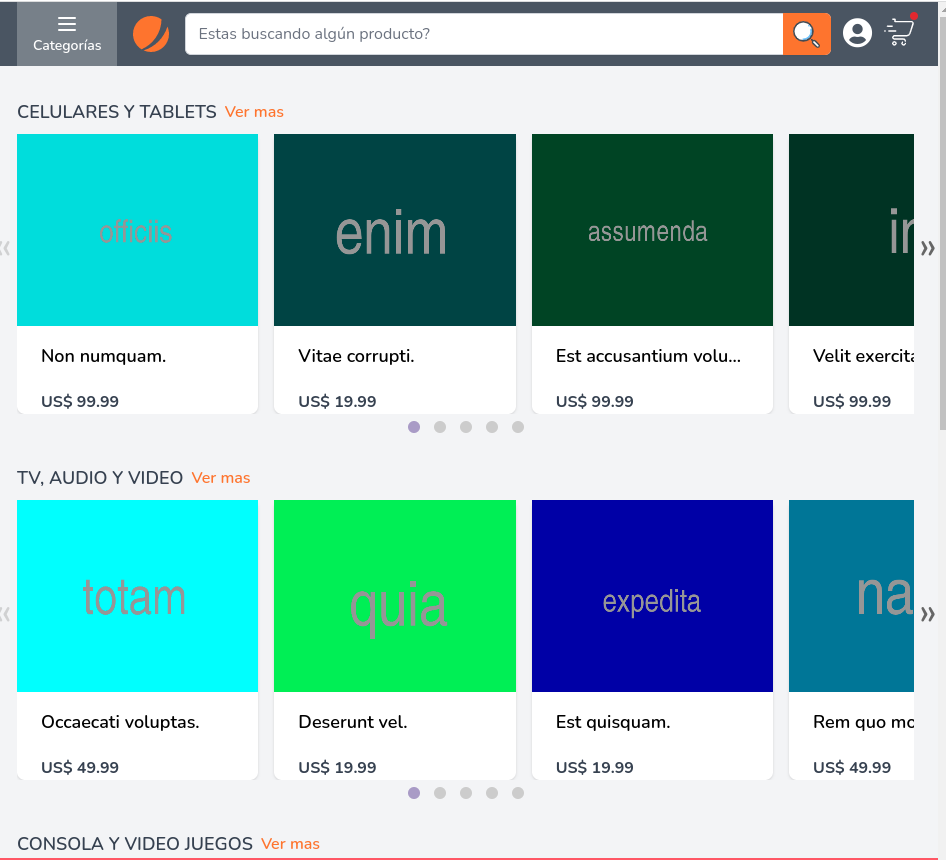
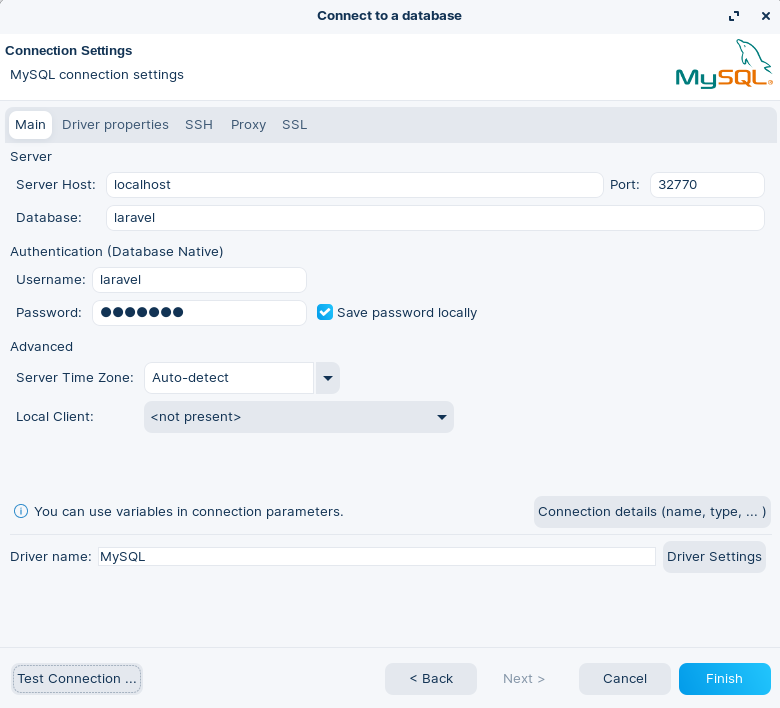

<p align="center"><a href="https://laravel.com" target="_blank"></a></p>

<p align="center">
<a href="https://travis-ci.org/laravel/framework"></a>
<a href="https://packagist.org/packages/laravel/framework"></a>
<a href="https://packagist.org/packages/laravel/framework"></a>
<a href="https://packagist.org/packages/laravel/framework"></a>
</p>

## Sistema de Ecommerce

**Blog**
[Blog - Ecommerce](https://gorgeous-puppy-eb536f.netlify.app/laravel/ecommerce/)

**Ambiente de Desarrollo**
```php
Lando

NAME                   ecommerce                                          
 LOCATION              /home/enrique/laravel/lando/EnriqueSousa/ecommerce 
 SERVICES              appserver_nginx, appserver, database, cache, node  
 APPSERVER_NGINX URLS  https://localhost:32769                            
                       http://localhost:32770                             
                       http://ecommerce.lndo.site/                        
                       https://ecommerce.lndo.site/
```

**Base de Datos**
```php
{ service: 'database',
    urls: [],
    type: 'mysql',
    healthy: true,
    internal_connection: { host: 'database', port: '3306' },
    external_connection: { host: '127.0.0.1', port: '32771' },
    healthcheck: 'bash -c "[ -f /bitnami/mysql/.mysql_initialized ]"',
    creds: { database: 'laravel', password: 'laravel', user: 'laravel' }
```

**Pantallas de Captura**



